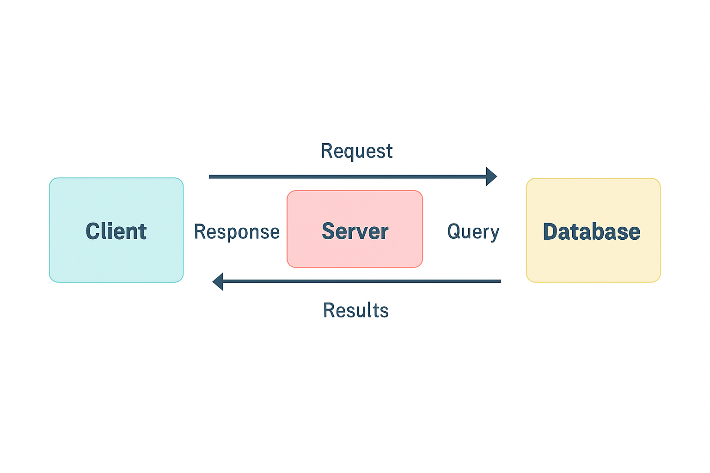

Finova Data Viewer

A web-based user interface design for viewing different stock indices information and cryptocurrency information, having a sidebar and interactive tables and buttons.

CLIENT SERVER MODEL

● What is a client?

A client is a device or software which requests information from a server. 
Example: A web browser requests webpages from a web server

● What is a server?

A server is a powerful computer, device or system which provides resources and information(data, webpages, apps) to multiple clients over a network.

● How do they communicate?

A client-server model works over a request-response model. A client sends a request for data or services, and the server processes the request and returns a response. During transmission, the data is divided into small packets and carried over a network. Protocols like TCP/IP ensure reliable packet delivery over a network.Protocols are part of the transmission mechanism and not the request. At the destination, all these small packets recombine and the server receives it, processes it and sends back a response with the requested content.

● What is supposed to happen internally when a user clicks “Search” in your UI?

When a user clicks "Search," the UI captures the text input, sends it to a backend server (search engine/API) for processing, which then queries an index/database, ranks results using complex algorithms (considering intent, context, quality), and sends relevant snippets back to the UI to display a dynamic, personalized results page, often with features like filters, previews, and related actions. 

The following diagram shows the flow of data in a client server model:

FULL STACK APPLICATION

● Frontend

The front end of a website or application refers to everything the user can see. Front-end developers often work directly with the client to create visual and interactive elements that work together and work with design teams to create the user interface (UI) or graphical user interface (GUI) in an effort to provide an easy-to-navigate and aesthetically pleasing design.

● Backend

 Back-end developers work on the parts of a website or application that users cannot see. They operate behind the scenes, making sure servers and databases function smoothly and quickly. Back-end developers build, test, maintain, and debug the technology that makes the software or website function. 

● Database

A database is an organized collection of structured data, like tables, allowing for efficient storage, management, and retrieval of vast amounts of information. It is controlled by a Database Management System (DBMS) that allows users add, modify, and query data using tools like SQL.

● APIs 

Application Programming Interfaces(APIs) takes a request, sends it to the server, retrieves the data, and returns the response. It is the invisible backbone of modern software development which enables different applications, platforms, or systems to communicate and exchange data seamlessly

APIs operate through a request response cycle between a client and a server

1) Request: The client sends a request to an API endpoint (URI).

2) Processing: The API forwards the request to the server.

3) Response: The server processes and sends back the requested data.

4) Delivery: The API returns the server’s response to the client.

● The Communication Flow
 
1) User Interaction (Frontend)

The user interacts with the frontend (e.g., clicks a "submit" button on a website). The frontend, which runs in their browser, is not aware how to store the data itself.

2) API Request

The frontend uses an API to send a request to the backend server. This request usually follows a standard format like HTTP and often includes data in JSON format.

3) Backend Processing

The backend server receives the API request, interprets it, and executes the necessary business logic.
If the request requires storing new information or retrieving existing data, the backend communicates with the database.

4) Database Interaction

The backend sends queries to the database to perform actions like creating, reading, updating, or deleting data. The database processes the query and sends the requested data or a confirmation back to the backend.

5) API Response

Once the backend has processed the request and received information from the database, it formulates a response.
This response is sent back to the frontend via the same API, typically in JSON format.

6) Frontend Update

The frontend receives the response from the API and updates the user interface accordingly.